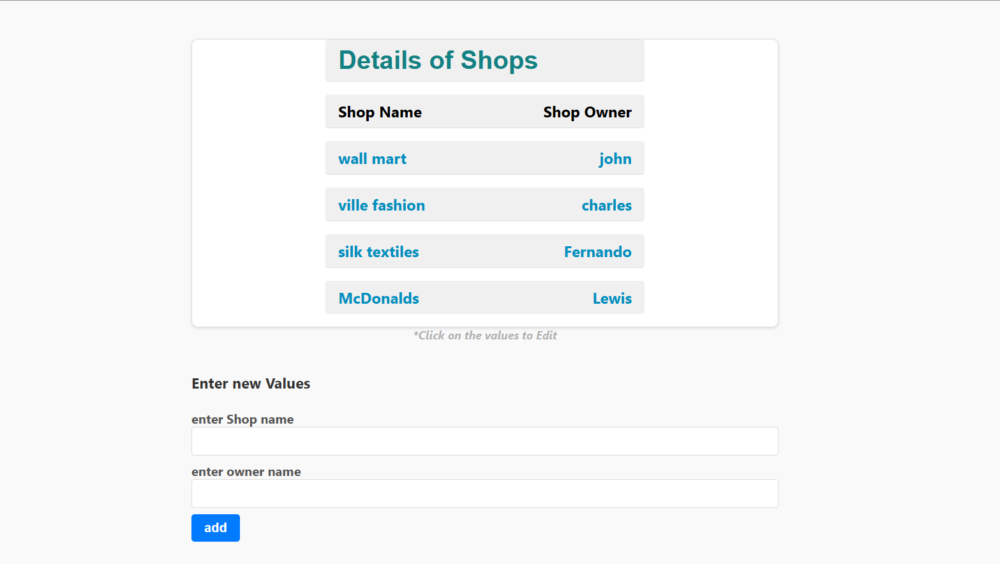

Shop App v1

This is a simple web application built with Svelte and Supabase that allows you to manage a list of shops and their owners. 
Here's a brief description of the functionalities and how it works.

Functionality : 

Display Shop Details: 
The application fetches shop details (shop ID, shop name, and shop owner) from a Supabase database table named shop_app_v1 and displays them in a table.

Edit Shop Details:
You can edit the shop name and owner by clicking on the respective row in the table. This will open input fields where you can modify the values. After making the changes, click the "Save" button to update the data in the database.

Cancel Editing: 
If you decide not to make any changes, you can click the "Cancel" button to discard the changes and go back to the original table view.

Add New Shop:
You can add a new shop by filling in the "Shop Name" and "Owner Name" input fields at the bottom of the page and clicking the "Add" button. This will insert a new row into the shop_app_v1 table in the Supabase database.

Error and Success Messages: 
The application displays appropriate messages when there are errors or successful operations, such as failed data fetching, successful data updating, or successful data insertion.

Technologies Used
Svelte: A component framework for building user interfaces.
Supabase: An open-source Firebase alternative that provides a backend-as-a-service solution, including a PostgreSQL database and authentication features.
